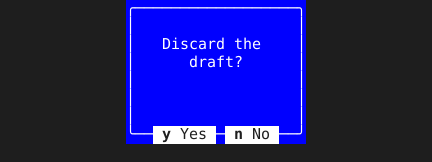

= Confirm

`Confirm` returns a tview modal with Yes and No chips on its bottom border.

== How an answer arrives

`done` receives `true` for a click on Yes or for `y`, and `false` for a click on No, `n` or `esc`. Enter, Tab and the arrow keys leave the question open. On narrow screens the chips can show just the keys.

Open it through a link:host.adoc[`Host`], which closes it before calling `done`, restores focus to where it was, and keeps the keyboard on the question even when the application moves focus while it is open:

[source,go]
----
host.Confirm("Discard the draft?", func(yes bool) {
	if yes {
		discard()
	}
})
----

On its own, the modal does not remove itself, so `done` is where the owner takes it off the screen. It is then modal only as long as the application leaves focus on it:

[source,go]
----
pages.AddPage("confirm", tuingo.Confirm("Discard the draft?", func(yes bool) {
	pages.RemovePage("confirm")
	if yes {
		discard()
	}
}), true, true)
----
